# Лабораторная работа №3 по Теории систем и системному анализу
Вариант 4
## Задание
1. На интервале [-2; 0] задана унимодальная функция одного переменного f(x) = cos(x)th(x).
   Используя метод имитации отжига осуществить поиск минимума f(x).
2. При аналогичных исходных условиях осуществить поиск минимума f(x), модулированной сигналом
   sin(5x), т.е. мультимодальной функции f(x)*sin(5x).
   
## Выполнение
Код файла, реализующего функцию имитации отжига, а также представляющего результаты в виде таблицы, приведен в main.cpp

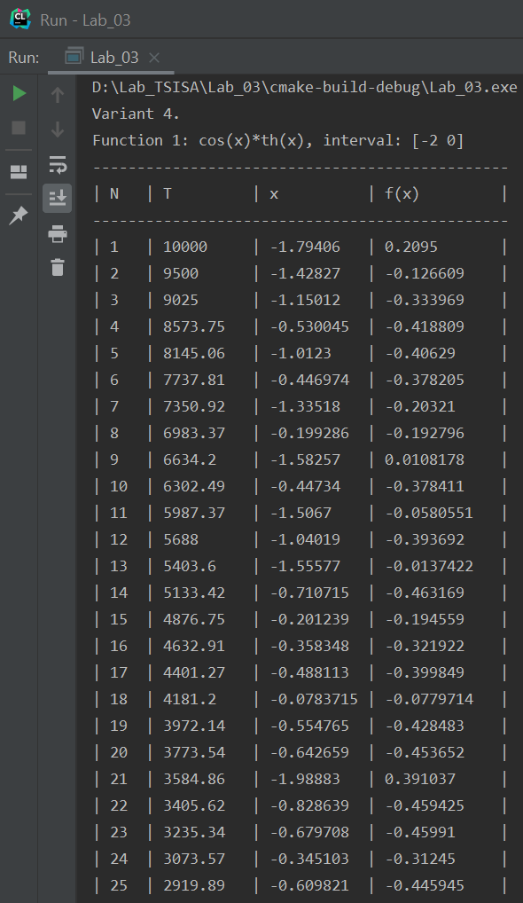
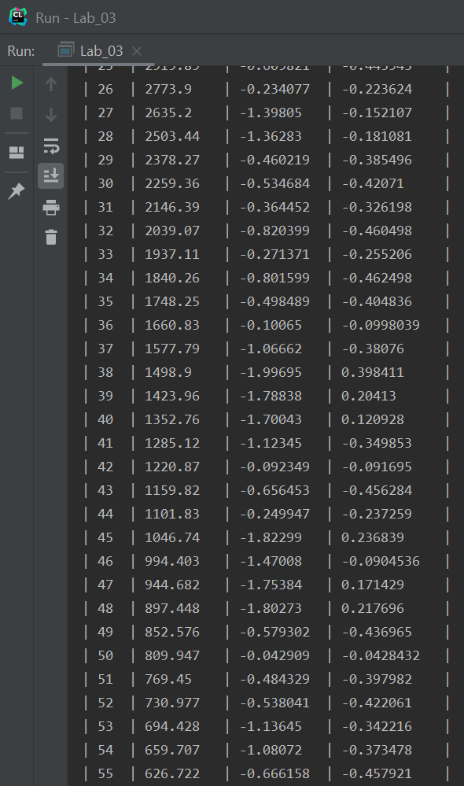
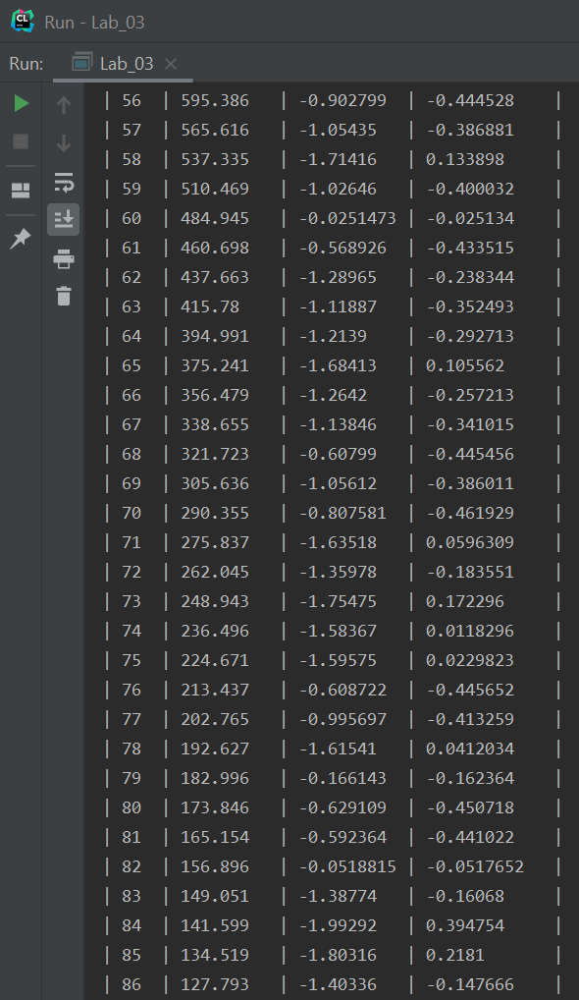
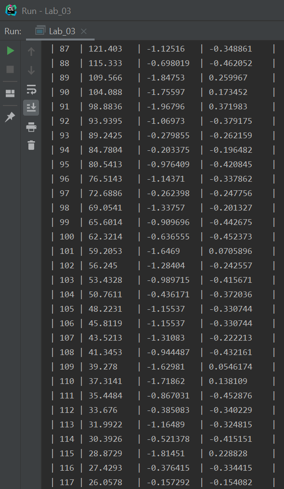
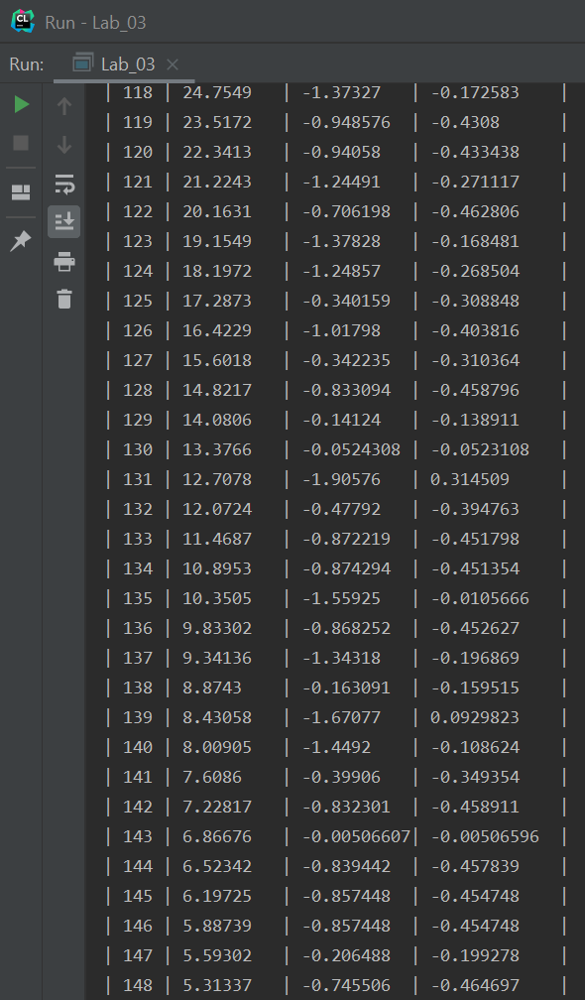
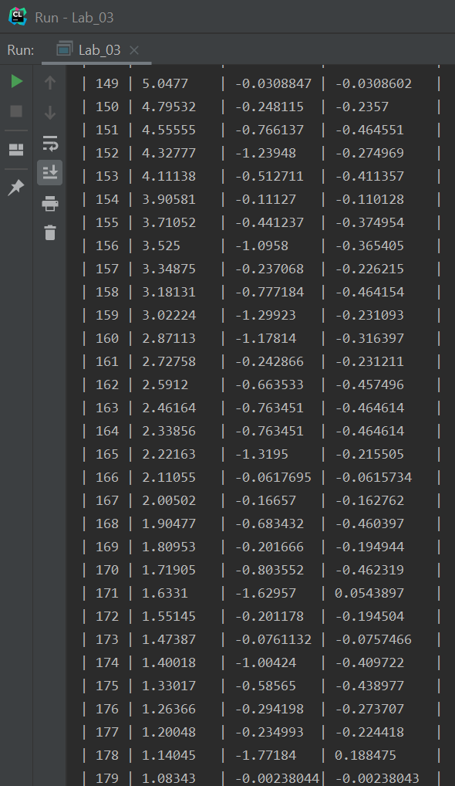
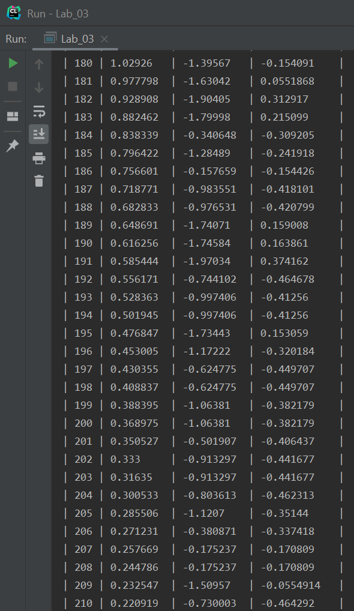
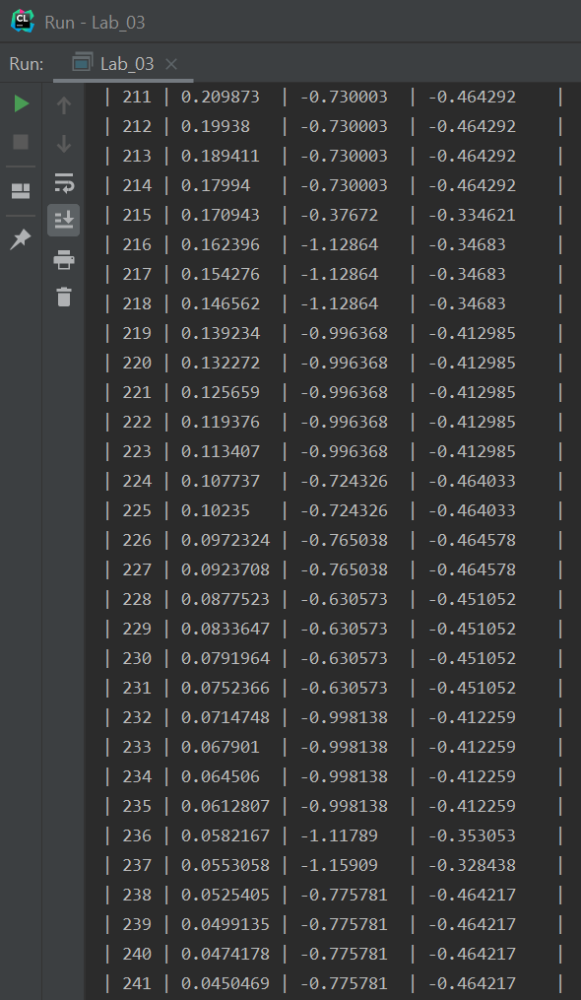
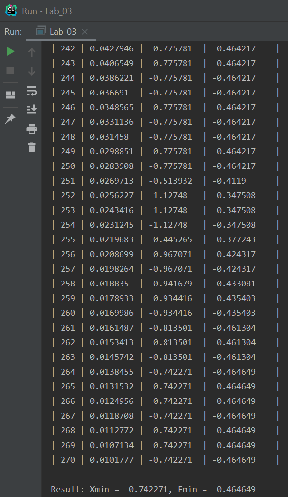
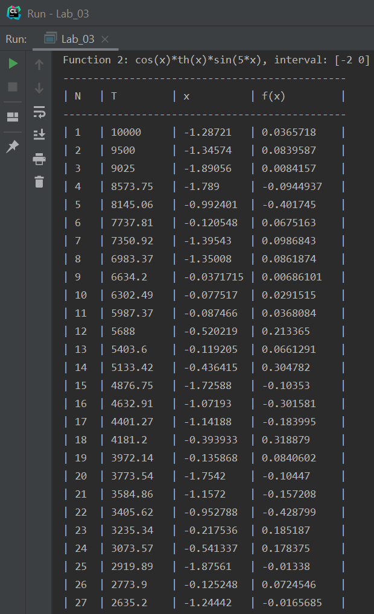
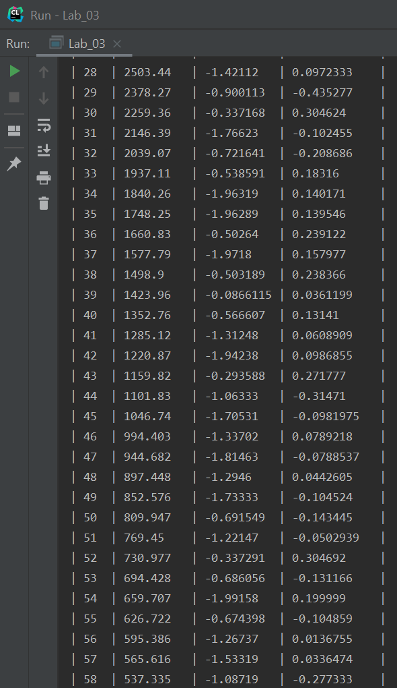
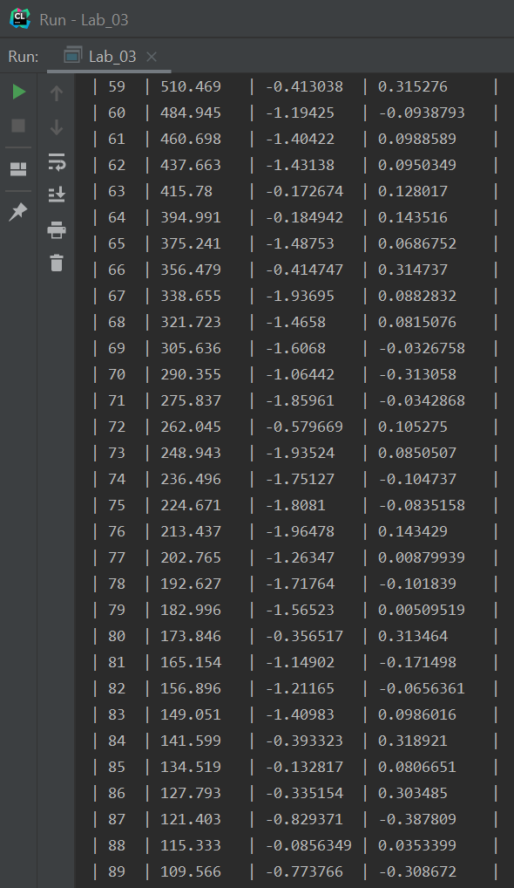
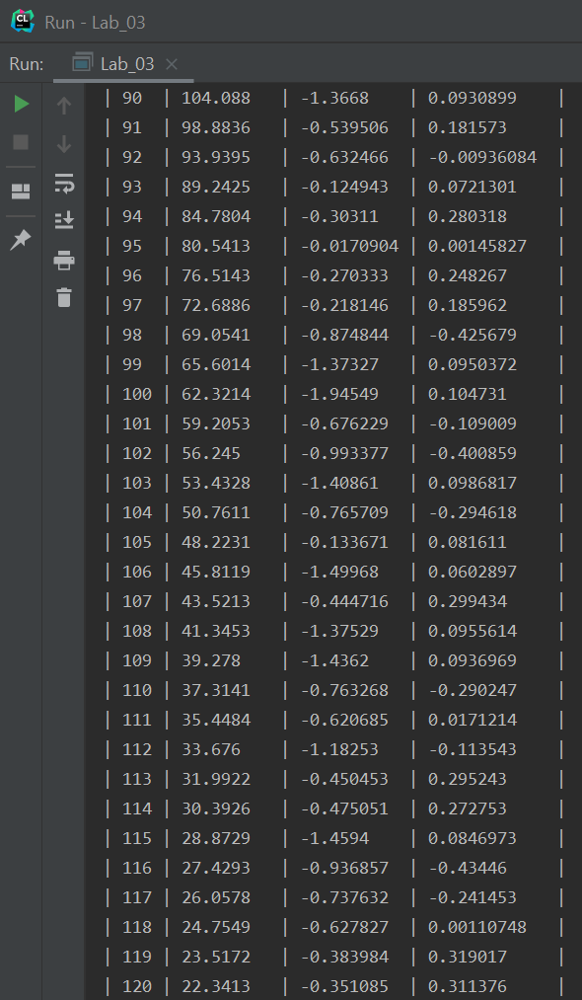
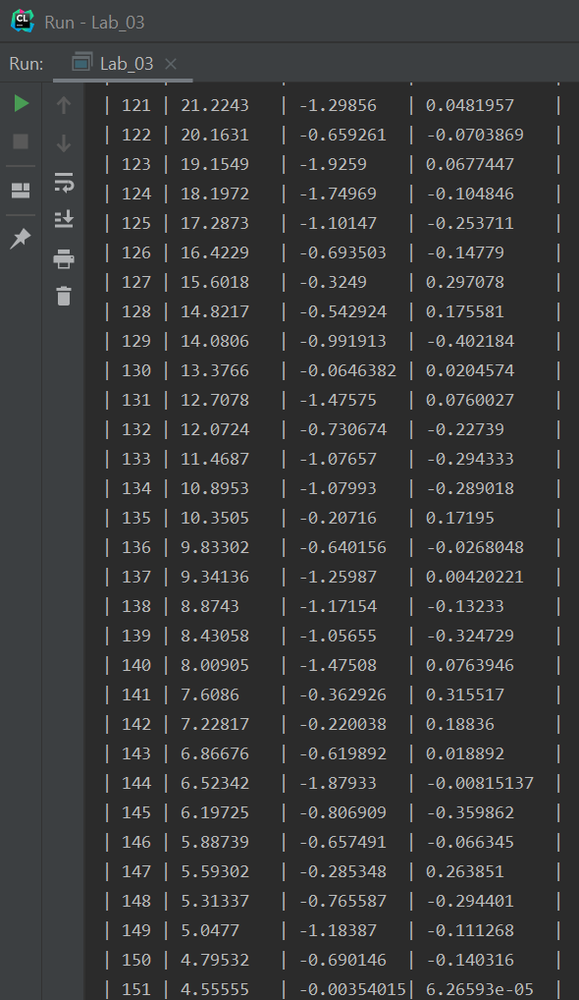
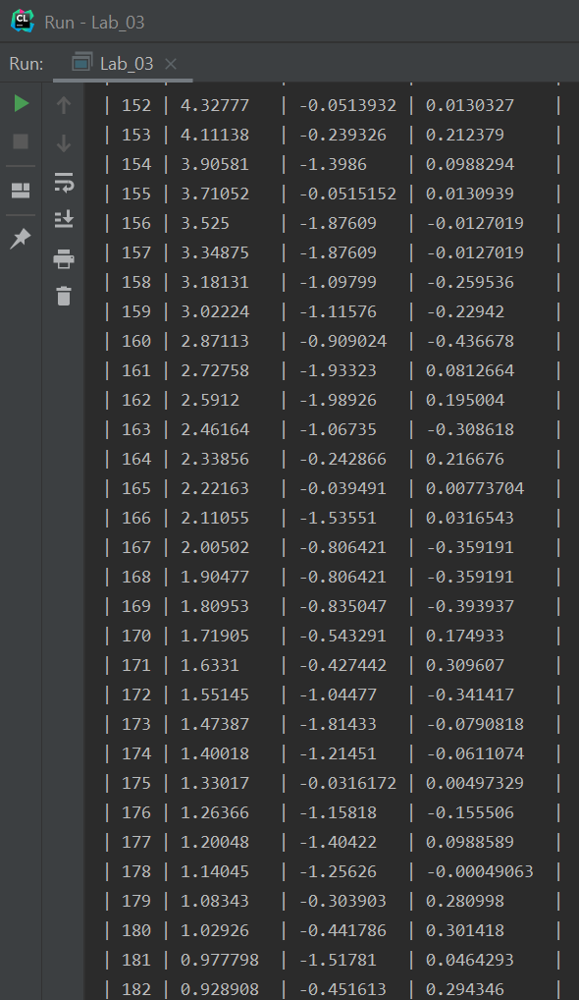
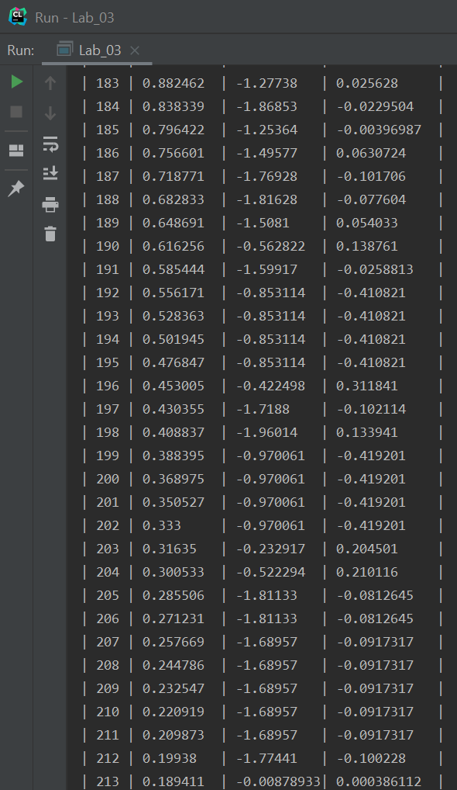
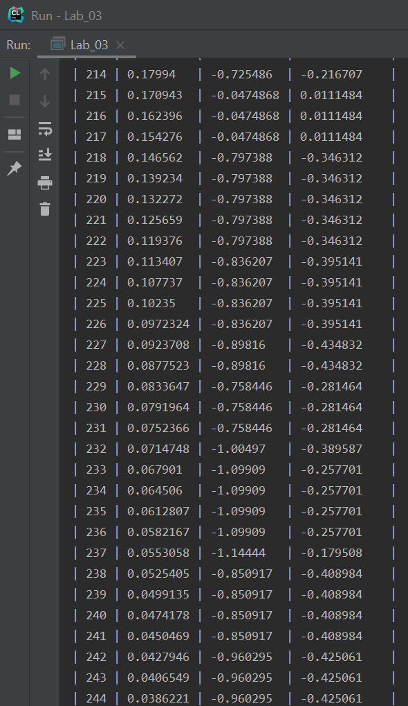
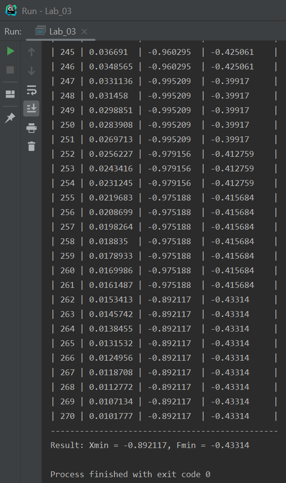
